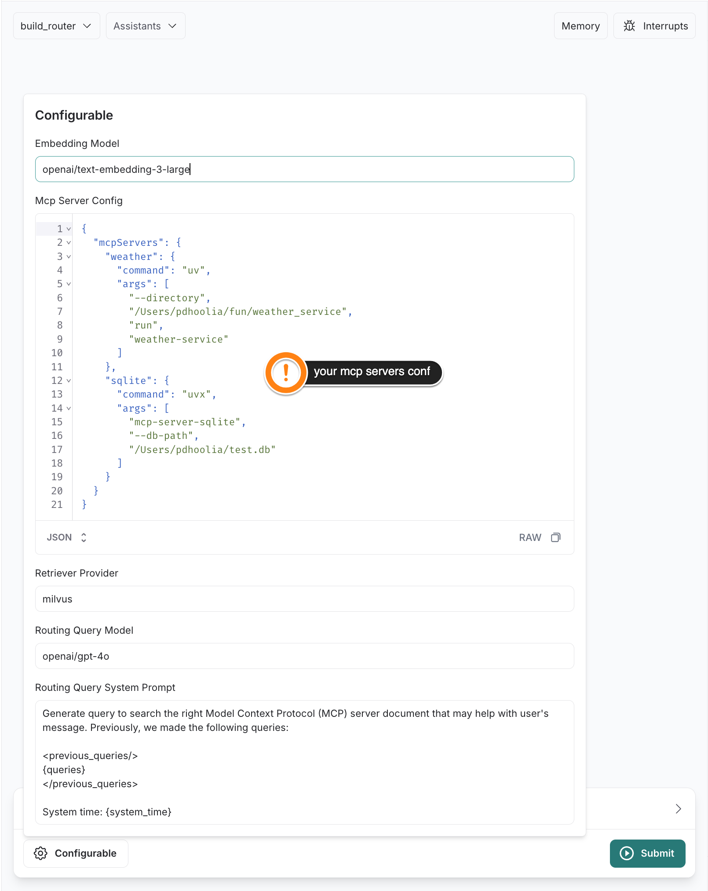
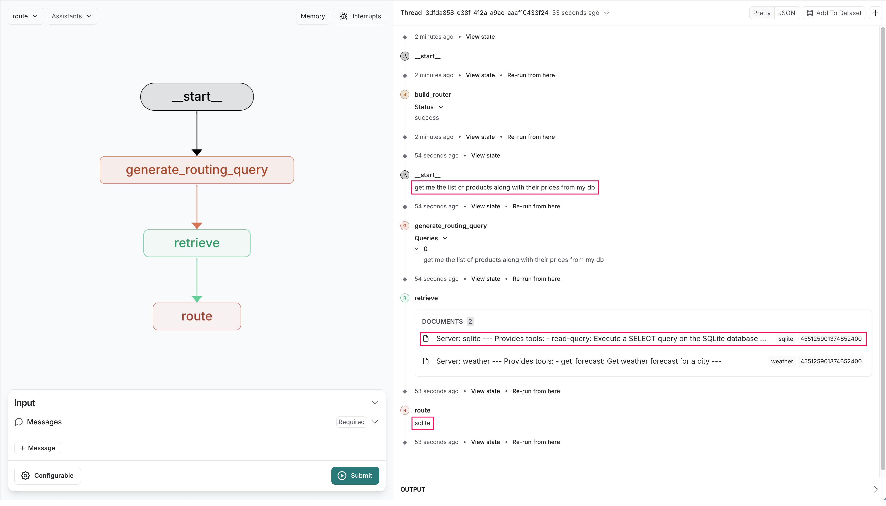

## Setup and run

1.  Create and activate a virtual environment
    ```bash
    python3 -m venv .venv
    source .venv/bin/activate
    ```

2.  Install Langgraph CLI
    ```bash
    pip install -U "langgraph-cli[inmem]"
    ```
    Note: "inmem" extra(s) are needed to run LangGraph API server in development mode (without requiring Docker installation)

3.  Install the dependencies
    ```bash
    pip install -e .
    ```

4.  Run
    ```bash
    langgraph dev
    ```

## Build the Router

`langgraph dev` should automatically take you to: https://smith.langchain.com/studio/?baseUrl=http://locahost:2024

**Plug your MCP server config and Submit**


[`build_router_graph.py`](src/langgraph_mcp/build_router_graph.py) collects information on tools, prompts, and resources offered by each MCP server; generates *routing instructions documents*, embeds them, and indexes using a vector db

## Use the Router

**Ask your question and see the routing response!**


[`router_graph.py`](src/langgraph_mcp/router_graph.py) generates a routing query given the current state of conversation, performs a vector index search, and routes to the relevant MCP server
