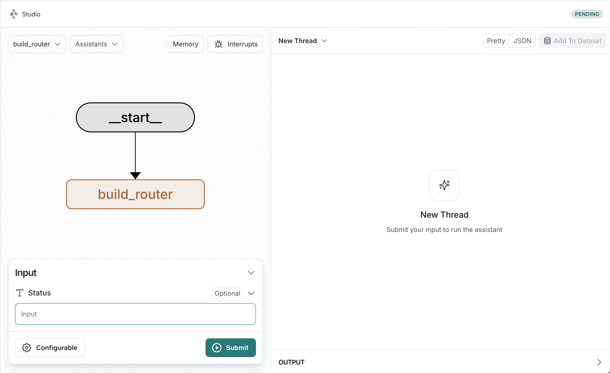

# LangGraph Solution Template for MCP

[Model Context Protocol (MCP)](https://modelcontextprotocol.io/introduction) is an open protocol that enables seamless integration between LLM applications and external data sources and tools. Whether you're building an AI-powered IDE, enhancing a chat interface, or creating custom AI workflows, MCP provides a standardized way to connect LLMs with the context they need. Think of MCP like a USB-C port for AI applications. Just as USB-C provides a standardized way to connect your devices to various peripherals and accessories, MCP provides a standardized way to connect AI models to different data sources and tools.

[LangGraph](https://langchain-ai.github.io/langgraph/) is a framework designed to enable seamless integration of language models into complex workflows and applications. It emphasizes modularity and flexibility. Workflows are represented as graphs. Nodes correspond to actions, tools, or model queries. Edges define the flow of information between them. LangGraph provides a structured yet dynamic way to execute tasks, making it ideal for writing AI applications involving natural language understanding, automation, and decision-making.

In this work, I combine LangGraph with MCP to build a conversational AI solution template. You may configure the solution with your MCP server configurations and run the [**build_router** graph](src/langgraph_mcp/build_router_graph.py). It collects information on tools, prompts, and resources for all the MCP servers that are part of the specified configurations, and generates a vector index. You may then use the [**assist** graph](src/langgraph_mcp/assistant_graph.py) as your assistant, facilitating conversations based on your MCP servers.

## Setup

1.  Create and activate a virtual environment
    ```bash
    python3 -m venv .venv
    source .venv/bin/activate
    ```

2.  Install Langgraph CLI
    ```bash
    pip install -U "langgraph-cli[inmem]"
    ```
    Note: "inmem" extra(s) are needed to run LangGraph API server in development mode (without requiring Docker installation)

3.  Install the dependencies
    ```bash
    pip install -e .
    ```

4.  Configure environment variables
    ```bash
    cp env.example .env
    nano .env
    ```

    Add your `OPENAI_API_KEY`.

    **Note**: I have added support for *Milvus Lite Retriever* (support file based URI). Milvus Lite won't work on Windows. For Windows you may need to use Milvus Server (Easy to start using Docker), and change the `MILVUS_DB` config to the server based URI. You may also enhance the [retriever.py](src/langgraph_mcp/retriever.py) to add retrievers for your choice of vector databases!

## Run

```bash
langgraph dev
```

`langgraph dev` should automatically take you to: https://smith.langchain.com/studio/?baseUrl=http://locahost:2024

## Try

### Build the Router

- Go to **Studio UI**: https://smith.langchain.com/studio/?baseUrl=http://locahost:2024
- Select the **build_router** graph (if not already selected)
- Go to **Configurations > MCP Server Config**
- Add your MCP server configurations in the standard format. [Here's a sample](sample-mcp-server-config.json).
- Provide a starting status (e.g., refresh)




[`build_router_graph.py`](src/langgraph_mcp/build_router_graph.py) collects information on tools, prompts, and resources offered by each MCP server. It generates *routing instruction documents* for each server, embeds them, and indexes in a vector db.

### Use Assistant

- Select the **assist** graph
- And ask away!

Here I ask the **assist-graph** about: *the weather in New Delhi*
- **start** node (on seeing no active mcp server) sends it to the *router sub-graph*
- **retrieve** node uses the router-index built in the other graph to retrieve relevant mcp server descriptions
- **route** node classifies to `weather` MCP server, and populates the active mcp server to `weather`
- **mcp_orchestrator**
    - fetches tools from `weather` MCP server
    - dynamically binds them to the LLM and invokes the LLM
    - which suggests `get_forcast` *tool_call* with appropriate arguments
- **mcp_tool_call**
    - calls `get_forecast` *tool* on the MCP server and adds a `ToolMessage` with its output
- **mcp_orchestrator** this time suggest a normal response generated based on the tool response
- Graph ends by displaying the response to the user


Next I digress and ask about: *the average price in my products database*
- **start** node on seeing active mcp server in the state sends it straight to the mcp orchestrator
- **mcp_orchestrator** attempts to respond using the current *weather* MCP server and its tools, and comes up with a **IDK** (I don't know) type of response. Sending the control to the *router sub-graph*
- **generate_routing_query** node generates an appropriate routing query based on the conversation so far
- **retrieve** node retrieves appropriate MCP server descriptions
- **route** node classifies to `sqlite` MCP server, and populates the active mcp server to `sqlite`

- - **mcp_orchestrator** & **mcp_tool_call** nodes loop over multiple times to use `list_tables`, `describe_table`, and finally `read_query` to fetch the average prices of products.

[`assistant_graph.py`](src/langgraph_mcp/assistant_graph.py) has all the logic for the assistant!


## MCP Wrapper

[`mcp_wrapper.py`](src/langgraph_mcp/mcp_wrapper.py) employs a Strategy Pattern using an abstract base class (`MCPSessionFunction`) to define a common interface for executing various operations on MCP servers. The pattern facilitates:
1.	Abstract Interface:
	- `MCPSessionFunction` defines an async `__call__` method as a contract for all session functions.
2.	Concrete Implementations:
    - Classes like `RoutingDescription`, `GetTools`, and `RunTool` implement specific operations (e.g., fetching tools, prompts, or executing a tool) by adhering to the `MCPSessionFunction` interface.
3.	Processor Function:
	- `apply` serves as a unified executor. It:
	    - Initializes a session using `stdio_client` from `mcp` library.
	    - Delegates the actual operation to the provided `MCPSessionFunction` instance via `await fn(server_name, session)`.
4.	Extensibility:
	- New operations can be added by subclassing `MCPSessionFunction` without modifying the core processor logic.


**Note**: In [`GetTools`](src/langgraph_mcp/mcp_wrapper.py#L58) I transform from `MCP`'s tool format to `LangChain`'s tool format. This allows dynamic binding of MCP server specific tools in the [mcp_orchestrator node](src/langgraph_mcp/assistant_graph.py#L159).