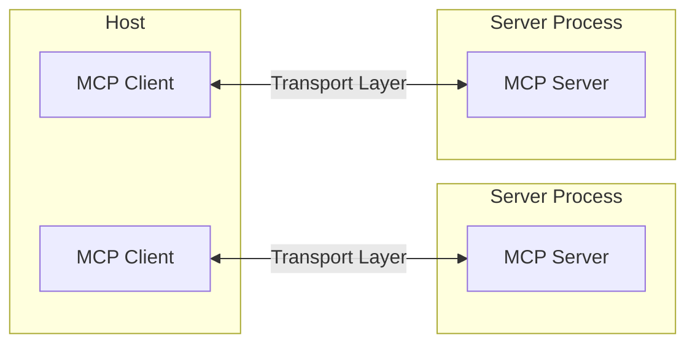
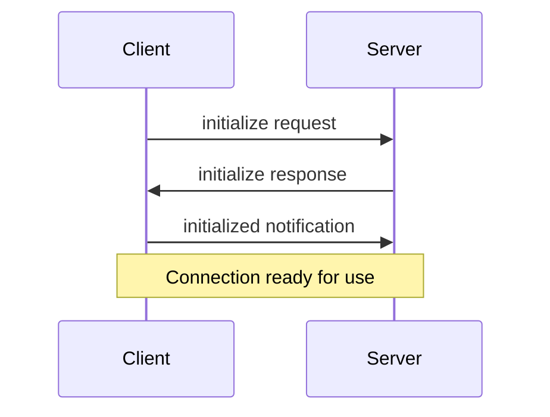

# MCP Architecture

```mermaid
flowchart LR
    subgraph "Host"
        client1[MCP Client]
        client2[MCP Client]
    end
    subgraph "Server Process"
        server1[MCP Server]
    end
    subgraph "Server Process"
        server2[MCP Server]
    end

    client1 <-->|Transport Layer| server1
    client2 <-->|Transport Layer| server2
```

```mermaid
sequenceDiagram
    participant Client
    participant Server

    Client->>Server: initialize request
    Server->>Client: initialize response
    Client->>Server: initialized notification

    Note over Client,Server: Connection ready for use
```