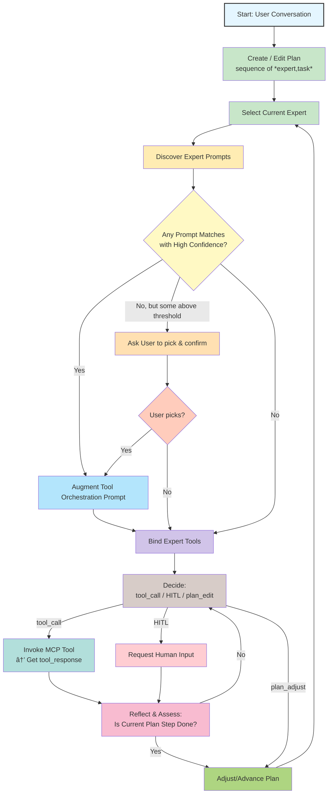

```mermaid
graph TD
    A[Start: User Conversation] --> B[Create / Edit Plan<br/>sequence of *expert,task*]
    B --> C[Select Current Expert]
    C --> D[Discover Expert Prompts]
    D --> E{Any Prompt Matches<br/>with High Confidence?}

    E -->|Yes| F[Augment Tool Orchestration Prompt]
    F --> G[Bind Expert Tools]
    
    E -->|No, but some above threshold| H[Ask User to pick & confirm]
    H --> I{User picks?}
    I -->|Yes| F
    I -->|No| G

    E -->|No| G

    G --> K[Decide:<br/>tool_call / HITL / plan_edit]
    
    K -->|tool_call| L[Invoke MCP Tool<br/>→ Get tool_response]
    L --> M[Reflect & Assess:<br/>Is Current Plan Step Done?]
    
    M -->|Yes| N[Adjust/Advance Plan]
    N --> C

    M -->|No| K

    K -->|HITL| O[Request Human Input]
    O --> M

    K -->|plan_adjust| N

    style A fill:#E5F6FF,stroke:#333,stroke-width:2px
    style B fill:#C8E6C9
    style C fill:#C8E6C9
    style D fill:#FFECB3
    style E fill:#FFF9C4
    style F fill:#B3E5FC
    style G fill:#D1C4E9
    style H fill:#FFE0B2
    style I fill:#FFCCBC
    style K fill:#D7CCC8
    style L fill:#B2DFDB
    style M fill:#F8BBD0
    style N fill:#AED581
    style O fill:#FFCDD2
```